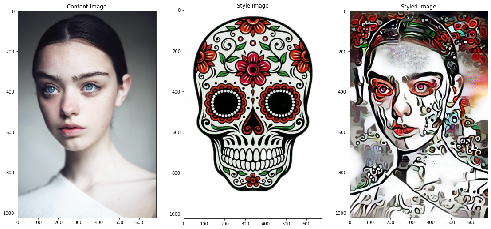

## Each folder represents a project

## cnn-transferlearning-exam:  Use convolutional neural network and transfer learning to categorize historical images. 
<b>School project:</b> Worked with a dataset of pictures of old handwritten dates e.g. 1857. Task was to build a classifier-model to read/predict dates from new pictures.

## conditional_tree_generate _dynamic_sentence_depending_on_data  
Dynamic news article generated with conditional tree
<b>Work project:</b> Survey into how we can make a dynamic system for generating news articles from data.
One solution is to have a conditional tree, that writes certain sentences when certain conditions are fullfilled. Demonstrates techniques/algorithms to build and traverse tree-structures in an efficent manner.

## robot-art  
Make a robot draw 3d on 2d surface.
<b>Passion projekt:</b> I am very interested in generative art. The art of making algorithms do art. For this i have purchased a small robot arm, and
this is the very first survey into how to get from a dataset of coordinates down on to physical paper.
 
<b>Demonstration of my robot:</b>
https://www.youtube.com/watch?v=IIEznpPxKdE

## text_classification_naive_bayes  
<b>Passion projekt:</b> Scraped danish job adds from  danish job sites. I saved the headlines and the job category. Example "ML-engineer søges til spændende startup" -> "IT". Thereafter i used the data to train a bayesian model to predict the jobcategory from an unknown job add headline.

## CNN Style transfer
<b>Passion project:</b> Learn how to copy style, so that we can apply techniques to robot-painting (Most code from internet).

